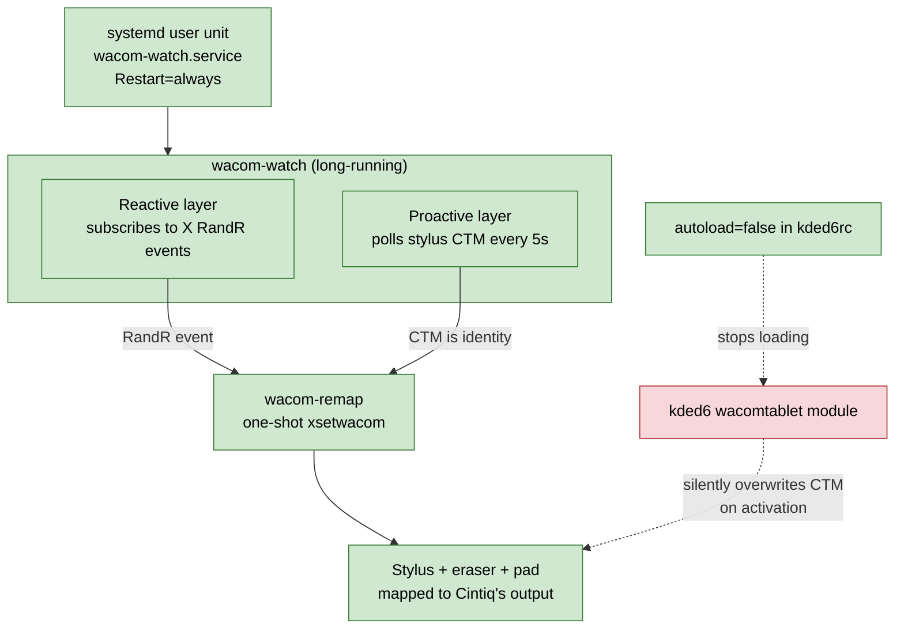

# Wacom Cintiq and Multi-Display Configuration

This chapter covers getting a `Wacom Cintiq 16 (2025)` working reliably under `KDE Plasma 6` on `X11`,
including the surprises that come with a multi-monitor `NVIDIA` setup. If you do not have a Wacom
tablet you can skip this chapter, although the window-placement section near the end is useful for
anyone running multiple displays.

The recurring problem on this hardware is that the pen "lands on the wrong screen". The cursor
appears on a monitor that is not the Cintiq, or it tracks across the union of all screens at once
so that the top-left of the tablet maps to the top-left of the entire desktop. Several layers can
each cause this independently. This chapter walks through every layer and shows how to neutralise
each one.

The companion scripts referenced throughout live in [../scripts](../scripts).

---

## 1. Why the Default Setup Fights You

By default the Wacom `X` driver maps the stylus across the **bounding box of every connected
monitor**, not just the tablet's own display. With three monitors connected, "tablet (0, 0)" ends
up at the top-left of whichever screen contains the global origin, which is almost never the
tablet itself.

`xsetwacom` can constrain that mapping, but the configuration does not persist. Anything that
touches `RandR` (Plasma's Edit Mode, plug or unplug, session restart, sometimes even a screen
waking from `DPMS`) wipes the mapping back to "full X screen union" again. On top of that, `KDE`
ships its own Wacom daemon that maintains a separate matrix and reapplies it silently on
activation, which can race against your `xsetwacom` settings.

The fix is layered:

1. A one-shot script that sets the mapping correctly.
2. A long-running watcher that re-runs the one-shot on every `RandR` event.
3. A polling watchdog that catches resets which do **not** fire a `RandR` event.
4. A `systemd` user service that supervises the watcher and restarts it if it dies.
5. A small `KDE` configuration change so the `kded` wacomtablet daemon stops fighting you.



Each piece is small. Together they make the pen stay where you put it.

---

## 2. Identifying the Cintiq's Output

`xsetwacom` accepts either an output name (like `HDMI-1`) or an explicit geometry
(`WIDTHxHEIGHT+X+Y`). On the `NVIDIA` proprietary driver the name form often fails with
`Unable to find an output 'HDMI-1'`. The geometry form always works, so the scripts in this
chapter use that.

To see your current layout:

```bash
xrandr --query | grep -E " connected"
```

Example output (yours will differ in resolutions, offsets, and connector names):

```
HDMI-0   connected           <WxH>+<X>+<Y> ... <main monitor size in mm>
HDMI-1   connected           <WxH>+<X>+<Y> ... 345mm x 216mm
DP-2     connected primary   <WxH>+<X>+<Y> ... <other monitor size in mm>
```

The Cintiq 16 reports as `345mm x 216mm` (its physical panel size). That physical size is the
most reliable way to find the tablet in the output list, because the connector name can change
if you replug into a different port. Match by physical size, read the geometry column next to
it.

To see your Wacom device names:

```bash
xsetwacom --list
```

Expected output for the Cintiq 16:

```
Wacom Co.,Ltd. Wacom Cintiq 16 Stylus stylus   id: 25  type: STYLUS
Wacom Co.,Ltd. Wacom Cintiq 16 Stylus eraser   id: 26  type: ERASER
Wacom Co.,Ltd. Wacom Cintiq 16 Stylus pad      id: 27  type: PAD
```

Note that the device prefix is `Wacom Co.,Ltd. Wacom Cintiq 16 Stylus` and the suffix is one of
`stylus`, `eraser`, or `pad`. All three need mapping or you will draw fine but erase across
random monitors.

---

## 3. The One-Shot Remap

Manual command (substitute the `WxH+X+Y` value you read from your own
`xrandr` output above):

```bash
GEOM="<WxH+X+Y for the 345mm x 216mm output>"
for sub in stylus eraser pad; do
  xsetwacom set "Wacom Co.,Ltd. Wacom Cintiq 16 Stylus $sub" MapToOutput "$GEOM"
done
```

To verify, draw on the Cintiq. The cursor should stay on that panel and the pen tip should match
the cursor position. If it does not, double-check that your `GEOM` value matches the line that
`xrandr` returned for the `345mm x 216mm` output.

The same logic packaged as a reusable script lives at [../scripts/wacom-remap](../scripts/wacom-remap).
Install it once:

```bash
install -Dm755 scripts/wacom-remap ~/.local/bin/wacom-remap
```

Then run `wacom-remap` any time the pen drifts. The script re-detects the geometry on every run,
so it follows layout changes automatically.

---

## 4. The Persistent Watcher

`wacom-remap` is a one-shot. To keep the mapping right without thinking about it, you need a
watcher that runs it for you. The version in [../scripts/wacom-watch](../scripts/wacom-watch) has
two layers.

**Reactive layer.** It subscribes to `X RandR` events via `xev -root -event randr`. When it sees
`RRScreenChangeNotify`, `RRCrtcChangeNotify`, or `RROutputChangeNotify`, it calls `wacom-remap`.
A one-second debounce coalesces the burst of events that `KWin` emits when you confirm a layout
change, so each reconfiguration triggers exactly one remap.

**Proactive layer.** Every five seconds it reads the stylus Coordinate Transformation Matrix via
`xinput list-props` and compares against the identity matrix. If the matrix is identity, the
mapping has been reset by something the reactive layer cannot hear (see section 5 for who and
why) and `wacom-remap` is called again. Five seconds is the sweet spot. Fast enough to recover
before you notice, slow enough that the per-second cost is negligible.

Logs land in two places:

```bash
tail -f ~/.cache/wacom-watch.log              # the script's own log
journalctl --user -u wacom-watch.service -f   # systemd lifecycle
```

---

## 5. KDE's Tablet Daemon Is Fighting You

This is the layer most people miss. `kded6`, the `KDE` daemon manager, loads a module called
`wacomtablet` by default. That module maintains its own Coordinate Transformation Matrix based on
its own configuration (controlled via *System Settings -> Tablet*) and reapplies that matrix
whenever it activates. Activation triggers include login, device hotplug, opening or closing the
Tablet *KCM*, and sometimes other input-device events.

None of those activations fires a `RandR` event, so the reactive watcher in section 4 does not
see them. The proactive watchdog catches them, but only after the polling interval. If the daemon
itself is configured with defaults, the matrix it writes is the identity, which is exactly the
"full X screen union" failure mode.

Check whether the module is loaded:

```bash
qdbus6 org.kde.kded6 /kded loadedModules | grep wacomtablet
```

If it returns `wacomtablet`, it is running.

If you manage the tablet entirely through `xsetwacom` (which everything in this chapter assumes),
the cleanest fix is to stop the daemon from loading at all. Add this to `~/.config/kded6rc`:

```ini
[Module-wacomtablet]
autoload=false
```

The snippet is also at [../scripts/kded6rc.snippet](../scripts/kded6rc.snippet).

Then unload the running instance without rebooting:

```bash
qdbus6 org.kde.kded6 /kded unloadModule wacomtablet
```

Verify:

```bash
qdbus6 org.kde.kded6 /kded loadedModules | grep -c wacomtablet
```

Expected output: `0`.

The trade-off is that *System Settings -> Tablet* will still open but will not apply anything.
The daemon that read those settings is now off. If you ever want that GUI back, delete the
`autoload=false` line and log out then back in.

---

## 6. A Supervised `systemd` User Service

A bare background script with no supervisor is the weakest link in the pipeline. If `xev`
crashes, the script exits and you lose the watcher until next login. Wrap it in a `systemd` user
unit with `Restart=always` instead.

The unit file is [../scripts/wacom-watch.service](../scripts/wacom-watch.service). Install it:

```bash
install -Dm755 scripts/wacom-watch         ~/.local/bin/wacom-watch
install -Dm644 scripts/wacom-watch.service ~/.config/systemd/user/wacom-watch.service
systemctl --user daemon-reload
systemctl --user enable --now wacom-watch.service
```

Confirm it is up:

```bash
systemctl --user status wacom-watch.service
```

Expected output (truncated):

```
● wacom-watch.service - Wacom Cintiq mapping watcher (RandR events + CTM watchdog)
     Loaded: loaded (~/.config/systemd/user/wacom-watch.service; enabled)
     Active: active (running)
```

Useful management commands:

```bash
systemctl --user restart wacom-watch.service       # bounce it
systemctl --user stop wacom-watch.service          # stop without disabling
systemctl --user disable wacom-watch.service       # stop autostart
journalctl --user -u wacom-watch.service -n 30     # last 30 log lines
```

If you previously used a `.desktop` autostart entry for the watcher, retire it now. Two starters
will double-spawn the watcher and you do not want two processes competing for the same `X` input
properties.

---

## 7. Window Placement on Multi-Monitor Setups

When you set up the tablet, you usually move the cursor onto it to test the pen. Once that
happens, `KWin`'s default behaviour is to consider the Cintiq the "active screen" for new
windows, because by default `Placement=Smart` and `ActiveMouseScreen=true` together open new
windows on whichever screen contains the pointer. New launches and application dialogs (notably
`Blender`'s file browser) then keep appearing on the Cintiq, which is rarely what you want when
the tablet is parked off to one side.

The fix is two lines in `~/.config/kwinrc`:

```ini
[Windows]
Placement=Centered
ActiveMouseScreen=false
```

The snippet lives at [../scripts/kwinrc.snippet](../scripts/kwinrc.snippet).

`Placement=Centered` opens new windows centred on the **focused** screen, not the
screen-under-cursor. `ActiveMouseScreen=false` decouples "active screen" from cursor position, so
just hovering the pen over the Cintiq does not promote it to active.

Reload `KWin` without logging out:

```bash
qdbus6 org.kde.KWin /KWin reconfigure
```

For transient windows (the technical term for dialogs that declare a parent window via
`WM_TRANSIENT_FOR`), `KWin` always uses `Placement=OnMainWindow`. That is hard-coded and does
not need configuration. Once the two lines above are in place, dialogs will follow their parent
window's screen reliably, which fixes the `Blender` "save dialog opens somewhere else" problem
without any application-specific tweaks.

---

## 8. The Bootstrap Script

The script at [../scripts/wacom-setup](../scripts/wacom-setup) rebuilds the entire pipeline from
scratch. It is idempotent, so it is safe to run any time. Use it after a fresh install or
whenever you suspect the pen automation has drifted from the documented design.

What it does, in order:

1. Verifies prerequisites (`xrandr`, `xsetwacom`, `xinput`, `xev`, `qdbus6`, `systemctl`,
   `awk`).
2. Detects the Cintiq's `xrandr` output by physical size.
3. Reinstalls `~/.local/bin/wacom-remap`.
4. Reinstalls `~/.local/bin/wacom-watch` with the watchdog.
5. Disables the `wacomtablet` `kded` module and unloads the running instance.
6. Retires any legacy `wacom-cintiq-mapping.{path,service}` units left over from older attempts
   at persistence.
7. Renames any legacy `wacom-watch.desktop` autostart entry.
8. Installs, enables, and starts `wacom-watch.service`.
9. Runs `wacom-remap` once to apply the mapping immediately.
10. Self-tests: forces the stylus matrix to identity, waits one polling window, and fails loudly
    if the watchdog did not recover the mapping.

Run it:

```bash
wacom-setup
```

Expected tail of output:

```
[hh:mm:ss] self-test: forcing CTM to identity, waiting 8s for watchdog
   watchdog recovered: 0.625000, 0.000000, 0.143066, ...
   ok

wacom-setup: done.
```

If the self-test fails, the script tells you exactly which logs to read.

---

## 9. Troubleshooting

**Pen lands on a monitor I cannot see.**

The mapping has been reset to identity, which sends the cursor to the global root window's
origin. If you have an off-screen monitor (for example, an `HDMI` display sitting at
`+0+3040` with no physical display attached), the cursor disappears into it. Run
`wacom-remap` from any terminal. Then check `tail ~/.cache/wacom-watch.log` to see whether
the watcher caught it.

**`wacom-watch.service` keeps restarting.**

```bash
journalctl --user -u wacom-watch.service -n 50
```

If you see `xev: connection to X server refused` it usually means the service started before
the `X` session was ready. The unit's `After=graphical-session.target` should prevent that,
but on some sessions `graphical-session.target` reaches `active` before `DISPLAY` is set.
Add a short `ExecStartPre=/bin/sh -c 'sleep 2'` if you hit this.

**`qdbus6` reports `wacomtablet` is loaded again after a `KDE` upgrade.**

Major `Plasma` upgrades can occasionally refresh `kded` module defaults. Re-check
`~/.config/kded6rc` and reapply the unload:

```bash
cat ~/.config/kded6rc | grep -A1 wacomtablet
qdbus6 org.kde.kded6 /kded unloadModule wacomtablet
```

**Pen geometry is wrong after moving the Cintiq in `KDE`'s display settings.**

The `+X+Y` offset has changed. Re-run `xrandr --query` to confirm the new offset, then run
`wacom-remap`. The watcher should pick this up automatically on the `RandR` event, but
running it manually is a fast confirmation that the geometry detection still works.

**Wayland.**

None of this chapter applies on `Wayland`. `xsetwacom`, `xinput`, and `xev` are `X11` tools.
On `KDE Plasma 6` Wayland sessions, configure tablets through *System Settings -> Tablet* or
`kcmshell6 kcm_tablet`.

---

## 10. Quick Reference

| Action                                | Command                                                                   |
| ------------------------------------- | ------------------------------------------------------------------------- |
| One-shot remap                        | `wacom-remap`                                                             |
| Full bootstrap or repair              | `wacom-setup`                                                             |
| Service status                        | `systemctl --user status wacom-watch.service`                             |
| Restart the supervisor                | `systemctl --user restart wacom-watch.service`                            |
| Tail the script log                   | `tail -f ~/.cache/wacom-watch.log`                                        |
| Tail the systemd log                  | `journalctl --user -u wacom-watch.service -f`                             |
| Confirm `kded` module is gone         | `qdbus6 org.kde.kded6 /kded loadedModules \| grep -c wacomtablet` (= `0`) |
| Reload `KWin` after `kwinrc` edits    | `qdbus6 org.kde.KWin /KWin reconfigure`                                   |

| [← Previous](./9_ssh_agent_setup.md) | [Next →](./11_hardening.md) |
|:--|--:|
