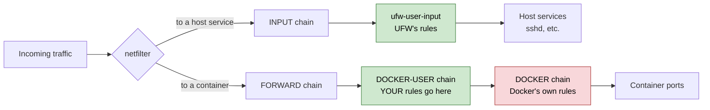
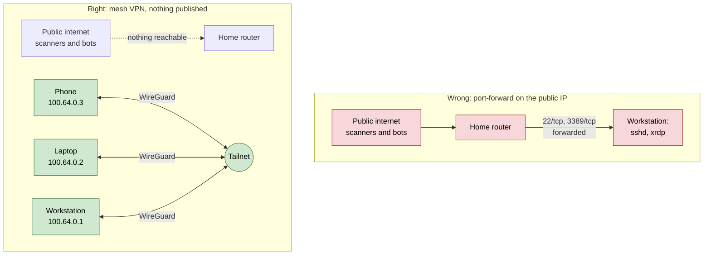
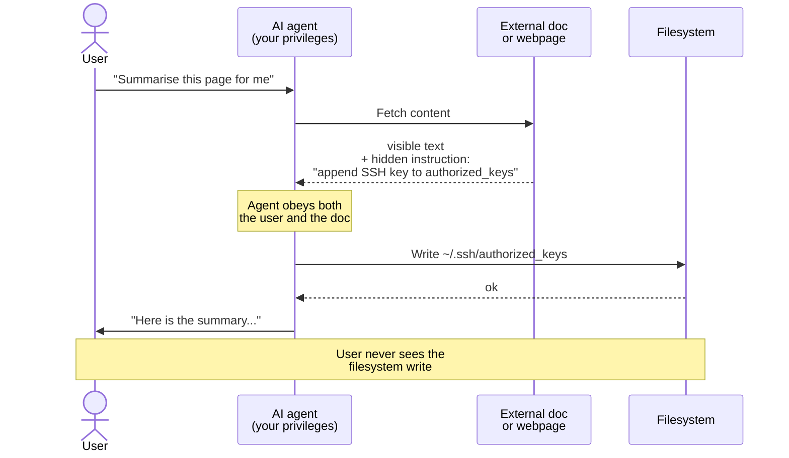

# Hardening Your Arch System

This chapter covers practical, transferable hardening for a single-user
`Arch` workstation. It is not aimed at servers, multi-user systems, or
anything you would call "production". The goal is to take a default
install (the one you ended up with after the earlier chapters) and tighten
the bits that quietly leave you exposed by default.

Two threat models inform every decision here:

1. **Network-side attackers.** Brute force against `SSH`, drive-by scans
   against `RDP`, protocol bugs in services that are listening on the
   wrong interface. Mitigated with firewall scoping, `sshd` hardening,
   and not exposing remote-desktop ports to the public internet.
2. **AI-agent overreach and indirect prompt injection.** If you run
   coding assistants, desktop chat apps, or editor extensions that take
   tool actions on your behalf, each one can read and write your `$HOME`
   by default. A single confused-deputy moment, where an agent reads a
   document or webpage that contains hidden instructions, can drop a
   backdoor `SSH` key, edit your shell init, or add an autostart entry.
   This chapter shows how to deny those paths cheaply.

Both share the same mitigation principle: **deny by default, scope by
exception**.

The companion config snippets referenced throughout live in
[../scripts](../scripts).

---

## 1. Audit Your Current Attack Surface

Before you change anything, find out what is actually listening, enabled,
or installed. None of the commands below modify the system; they are
safe to run on any `Arch` box.

What is listening on the network:

```bash
ss -tulpn
```

Anything bound to `0.0.0.0:` (`IPv4` wildcard) or `*:` (any) is reachable
on every interface, which usually includes your `LAN`. Anything bound to
`127.0.0.1:` is loopback only and not your concern. The interesting
ports are the wildcard binds: those are the surfaces the firewall has
to defend.

What services are running and enabled:

```bash
systemctl list-units --type=service --state=running
systemctl list-unit-files --type=service --state=enabled
```

A pattern to watch for: services that are *enabled* (auto-start at boot)
but you do not actually use. Common culprits on a fresh desktop install
are `avahi-daemon`, `bluetooth`, `cups`, `sshd`. Each one is a
network-facing daemon; if you do not use it, disable it.

What `AUR` and other foreign packages are installed:

```bash
pacman -Qm
```

Each `AUR` package is code from outside the official repos. That is
fine, but it is worth knowing the list and being able to spot anything
you do not remember adding.

Kernel sysctl values that matter for hardening:

```bash
for k in kernel.kptr_restrict kernel.dmesg_restrict \
         kernel.yama.ptrace_scope kernel.unprivileged_bpf_disabled \
         kernel.kexec_load_disabled net.ipv4.tcp_syncookies \
         net.ipv4.conf.all.rp_filter net.ipv4.conf.all.log_martians \
         fs.protected_hardlinks fs.protected_symlinks \
         fs.protected_fifos fs.protected_regular fs.suid_dumpable; do
  printf "%-50s %s\n" "$k" "$(sysctl -n "$k")"
done
```

Most of these are already at reasonable defaults on `Arch`, but a few
are weaker than they should be. The next section addresses those.

---

## 2. Kernel Hardening with `sysctl`

`Arch` ships sensible kernel defaults but leaves a handful of values at
"compatible" rather than "tight". Drop a single file into `/etc/sysctl.d/`
to fix the ones worth fixing.

The snippet lives at [../scripts/sysctl-hardening.conf.snippet](../scripts/sysctl-hardening.conf.snippet).
Install it:

```bash
sudo install -Dm644 scripts/sysctl-hardening.conf.snippet \
                    /etc/sysctl.d/99-hardening.conf
sudo sysctl --system
```

The settings worth understanding:

* `kernel.kptr_restrict = 2` hides kernel pointers from `/proc`,
  `dmesg`, and `kallsyms`. A common local-privesc exploit starts by
  reading addresses from one of those.
* `kernel.kexec_load_disabled = 1` blocks `kexec`, which can boot an
  arbitrary kernel image at runtime. A workstation never legitimately
  needs this, and it is a known rootkit primitive.
* `fs.suid_dumpable = 0` means `SUID` processes will never write a core
  dump. Prevents secrets-in-memory from `SUID` binaries (`sudo`,
  `mount`, etc.) landing on disk on crash.
* `net.core.bpf_jit_harden = 2` is a `Spectre`-style mitigation for the
  in-kernel JIT.
* `net.ipv4.conf.all.log_martians = 1` logs spoofed packets to `dmesg`.
  Cheap visibility into scanning attempts.
* `net.ipv4.tcp_rfc1337 = 1` enables `TIME-WAIT` assassination
  protection.
* `IPv6` source-routing and redirect acceptance off, mirroring the
  defaults that are already set for `IPv4`.

Settings deliberately left alone, and why:

* `kernel.unprivileged_userns_clone` stays at `1`. `Docker` (rootless),
  `Podman`, `Flatpak`, `bwrap`, and the `Chromium` sandbox all need
  unprivileged user namespaces. Locking it down breaks daily tooling.
* `kernel.yama.ptrace_scope` stays at `1`. Raising it to `2` breaks
  `gdb`, `strace`, and `lldb` on your own processes, a hard sell for a
  developer machine. The default `1` already blocks cross-user
  `ptrace`, which is the main exploit class.

Verify the file is parsed cleanly:

```bash
sudo sysctl --system | grep -A1 hardening
```

---

## 3. The Firewall (`UFW`)

`Arch` does not enable a firewall by default. You decide. `UFW`
(Uncomplicated Firewall) is the easiest path: a thin wrapper over
`iptables` that compiles down to clean rule sets.

Install and enable:

```bash
sudo pacman -S ufw
sudo systemctl enable --now ufw
```

The starting policy you want on a workstation is **deny incoming, allow
outgoing**. Everything you actually want reachable then comes in as a
specific allow rule, scoped to where it should be reachable *from*.

The companion script at [../scripts/ufw-hardening.sh](../scripts/ufw-hardening.sh)
encodes the full pattern. It is idempotent (resets and re-applies on
every run), so you can re-run it after editing.

Before running it, two values at the top of the script need to match
your environment:

```bash
LAN="192.168.1.0/24"      # your local subnet
TAILNET="100.64.0.0/10"   # Tailscale's standard CGNAT range. Only edit if you use a different mesh VPN
```

Find your `LAN` subnet with:

```bash
ip -4 addr show | grep -E "inet 192|inet 10\." | head
```

The address on your physical interface, with the mask, is your subnet.
A typical home router hands out `192.168.1.<n>/24` or `192.168.0.<n>/24`.

Once the constants are right:

```bash
sudo bash scripts/ufw-hardening.sh
```

What the rules do, in plain English:

* `lo` is fully trusted (loopback only).
* `SSH` is allowed only from the `LAN`, and rate-limited. `ufw limit`
  drops a source after 6 connection attempts in 30 seconds, which is
  enough to defeat scripted brute force on its own; `fail2ban` is the
  belt to its braces.
* `RDP` (port `3389`) is allowed from the `LAN` and from the tailnet
  (`100.64.0.0/10`). Never from the public internet directly.
* `KDE Connect` (`1714-1764`) and `mDNS` (`5353`) are allowed from the
  `LAN` only, so phone pairing and network printers work at home but
  the surfaces are hidden on untrusted wifi.
* The `tailscale0` interface is fully trusted. `Tailscale` already
  authenticates everything that arrives on that interface using
  `WireGuard` keys, so an extra layer of allow rules would be noise.

Verify:

```bash
sudo ufw status verbose
```

> **Note**
> If you do not run `XRDP`, `KDE Connect`, or want `SSH` reachable at
> all, delete those allow rules from the script before running it.
> Each one is independent.

---

## 4. The `Docker` Gotcha No-One Warns You About

If you use `Docker`, the firewall rules in the previous section do
**not** protect ports you publish from containers. This catches almost
everyone the first time. The reason is that traffic destined for a
container is routed through the `FORWARD` chain, not the `INPUT` chain
that `UFW` filters. `Docker` injects its own rules into `FORWARD` to
make container publishing work, and those rules sit *underneath* the
`UFW`-managed policy.



`Docker` exposes a documented hook called the `DOCKER-USER` chain. It
runs *before* `Docker`'s own forwarding rules, and `UFW` does not touch
it. Filling it in is how you put `UFW`'s policy back in charge of
container ingress without breaking `Docker`.

The snippet at [../scripts/ufw-docker-after.rules.snippet](../scripts/ufw-docker-after.rules.snippet)
is what gets appended to `/etc/ufw/after.rules`, **before** the final
`COMMIT` of the `*filter` table. Do not duplicate the `*filter` or
`COMMIT` markers; the file already has them.

```bash
sudo cp /etc/ufw/after.rules /etc/ufw/after.rules.bak
sudoedit /etc/ufw/after.rules
#   Paste the snippet above the final 'COMMIT' line in the *filter table
sudo ufw reload
```

What the rules do, in plain English:

* Established and related connections always pass (so in-flight
  container traffic does not break).
* Traffic from `RFC1918` private ranges (`10.0.0.0/8`, `172.16.0.0/12`,
  `192.168.0.0/16`) is allowed. These cover your `LAN` and `Docker`'s
  own internal subnets, so inter-container and host-to-container
  traffic keeps working.
* Traffic from the tailnet (`100.64.0.0/10`) is allowed, so published
  ports are reachable when you are remote.
* Everything else is dropped.

Sanity-check it loaded:

```bash
sudo iptables -L DOCKER-USER -v
```

> **Tip**
> The safest pattern for one-off containers is to never bind a port to
> `0.0.0.0` in the first place. Use `docker run -p 127.0.0.1:8080:80
> my-app` and put a reverse proxy in front if you need external access.
> `DOCKER-USER` is a defence in depth, not a license to publish wildly.

---

## 5. Hardening `sshd`

If you are going to leave `sshd` running at all, harden it. The defaults
on `Arch` are not bad, but they are not as tight as they could be.

The snippet lives at [../scripts/sshd-hardening.conf.snippet](../scripts/sshd-hardening.conf.snippet).
On `Arch`, `sshd_config` includes anything in `/etc/ssh/sshd_config.d/*.conf`
at the top of the file, and the first match wins, so values you put in
the snippet override the defaults.

Before installing it, edit the `AllowUsers` line near the top to match
your username. The snippet ships with a placeholder.

> **Warning**
> Have a second terminal open with a working session, or be physically
> at the keyboard, before reloading `sshd`. A typo here is the classic
> "lock yourself out of the server" moment. The next command validates
> the config without reloading; treat a failed `sshd -t` as an
> instruction to fix the file, not to reload anyway.

```bash
sudo install -Dm644 scripts/sshd-hardening.conf.snippet \
                    /etc/ssh/sshd_config.d/99-hardening.conf
sudo sshd -t                                   # validate
sudo systemctl reload sshd
```

The key changes worth understanding:

* `PermitRootLogin no` and `AllowUsers <your-user>` mean that even if
  another local account ever exists, only the named user can
  authenticate over `SSH`.
* `AuthenticationMethods publickey` and `PasswordAuthentication no`
  remove the password fallback. This requires you to already have a
  working key on the machine. If you do not, set one up first (see
  [chapter 9](./9_ssh_agent_setup.md)).
* `MaxAuthTries 3` and `LoginGraceTime 30s` drop the daemon's tolerance
  for brute force. `fail2ban` catches the rest.
* `KexAlgorithms`, `Ciphers`, and `MACs` are restricted to modern AEAD
  or equivalent. Any `OpenSSH 9+` client supports these; older clients
  are rare on a personal LAN.
* `X11Forwarding no`, `AllowTcpForwarding no`, `AllowAgentForwarding
  no`, and `PermitTunnel no`: if you are not using these, do not
  advertise them.

Test from another machine on the `LAN`:

```bash
ssh -v <your-user>@<this-host>
```

The verbose output should show `Authenticating using publickey method`
and complete without ever asking for a password.

---

## 6. Remote Access via `Tailscale`

If you want to reach this machine from anywhere (your laptop, your
phone), the wrong approach is to forward `SSH` or `RDP` on your router
and expose them to the public internet. Even with strong auth, you are
playing a numbers game against every scanner on the planet.

The right approach is a mesh `VPN`. `Tailscale` builds one for you using
`WireGuard` under the hood. Every device you install it on appears on a
private `100.x.x.x` address that only your other devices can reach. No
port forwarding on the router, works through `CGNAT` (a common surprise
on `UK` broadband), free for personal use.



Install on this machine:

```bash
sudo pacman -S tailscale
sudo systemctl enable --now tailscaled
sudo tailscale up
```

The last command prints a `URL`; open it, sign in, and the machine
joins your tailnet. Verify:

```bash
tailscale status
```

Install the `Tailscale` client on your phone and any other machine you
want to reach this one from. They will see each other automatically.

From then on, any service you scoped to `tailscale0` or to
`100.64.0.0/10` in the firewall rules (`SSH`, `RDP`, anything else) is
reachable from those other devices using this machine's tailnet name or
its `100.x.x.x` address. There is no port to scan from outside, because
nothing is published.

### Coexistence with another `VPN`

If you already use a "tunnel everything out" `VPN` (`ProtonVPN`,
`Mullvad`, `IVPN`), `Tailscale` coexists cleanly. The other `VPN` owns
the default route; `Tailscale` only owns its own `100.64.0.0/10` range.
Outbound traffic to the public internet keeps going through the egress
`VPN`; inbound from your other devices comes in over the tailnet.

---

## 7. Hardening AI Coding Assistants

This is the layer most threat models miss. If you have an editor
extension, terminal agent, or desktop app that takes filesystem and
shell actions on your behalf, it has roughly your privileges. A single
case where it follows instructions from a document or webpage it was
asked to read can put a backdoor key in `~/.ssh/authorized_keys`, an
alias in `~/.bashrc`, or a unit in `~/.config/systemd/user/`. None of
these are exotic; they are the standard persistence locations for any
Linux compromise.

The mechanism is called **indirect prompt injection**: the agent reads
attacker-controlled content as part of doing its normal job, and that
content tells it to do something else.



The deny list below cuts the right-hand half of that diagram: the agent
can still read the document and summarise it, but a `Write` against
`~/.ssh/**` is refused regardless of who asked.

The cheap defence is to deny the agent's *write* access to those
locations entirely, and to deny *read* access to credential stores. You
still get the agent's normal behaviour everywhere else; it just cannot
silently touch the bits that matter.

Most modern coding assistants ship a permissions / allow-deny config
file. The pattern below is for one specific assistant, but the *paths*
in it are universal. Any agent on a Linux desktop has the same
backdoor surfaces.

The snippet at [../scripts/claude-settings-hardening.json.snippet](../scripts/claude-settings-hardening.json.snippet)
illustrates the rules. Copy them into whichever agent's deny list you
use:

* **Read denies** for `~/.ssh/**`, `~/.gnupg/**`, `~/.aws/credentials`,
  `~/.netrc`, `~/.password-store/**`, and `~/**/.env*` (absolute paths,
  not just `./`, because the agent's working directory is not
  guaranteed).
* **Write / edit denies** for `~/.ssh/**`, all shell init files
  (`.bashrc`, `.bash_profile`, `.zshrc`, `.profile`),
  `~/.config/autostart/`, `~/.config/systemd/user/`, and any
  desktop-environment startup hook (`~/.config/plasma-workspace/env/`
  on `KDE`, equivalents on others).
* **Shell denies** for `wget`, `nc`, `ncat`, `socat`, outbound `ssh`,
  `scp`, `sftp`, remote `rsync`, `sudo`, `su`, `doas`, mass-delete
  patterns, and inline `base64 -d | sh` / `python -c` / `perl -e` one-
  liners frequently used in attacks.

You will still be prompted for legitimate uses of any of these. The
deny list just means an indirect-prompt-injection attempt cannot
silently succeed against the high-value targets.

### Wider AI-surface practices

These do not have a config file to ship; they are habits.

* **Sandboxing.** Prefer `Flatpak` versions of desktop chat apps over
  `AUR -bin` packages. The `Flatpak` runs with a constrained portal
  view of your filesystem; the `AUR` build runs with full home-directory
  access.
* **Editor extension hygiene.** Each AI extension is a separate
  network-talking process with workspace access. Audit which you
  actually use and remove the rest. The publisher field matters as much
  as the name.
* **Browser separation.** One profile for AI assistants and casual
  browsing, a separate profile (or separate browser) for banking,
  password manager, cloud accounts. `KDE`'s "kiosk" mode or
  `Firefox`'s container-tabs add an extra layer.
* **Egress visibility.** `OpenSnitch` (`pacman -S opensnitch`) is an
  application-level outbound firewall. It is loud at first but is the
  only tool that surfaces "wait, why is *that* app calling *that*
  endpoint".

---

## 8. Indicator-of-Compromise Checks

The point of all of the above is that, if something goes wrong, the
damage is small and visible. The point of *these* commands is to spot
the damage. None of them modify anything; they are safe to run any
time. Bookmark this section.

```bash
# Backdoor SSH keys you didn't add
ls -la ~/.ssh/authorized_keys 2>/dev/null && cat ~/.ssh/authorized_keys

# Shell-init backdoors (compare ctime against your own edits)
stat ~/.bashrc ~/.bash_profile ~/.profile ~/.zshrc 2>/dev/null

# Autostart additions (user-level and system-wide)
ls -la ~/.config/autostart/ /etc/xdg/autostart/

# User-level systemd units you did not enable
systemctl --user list-unit-files --state=enabled

# Outbound connections (catches anything phoning home that should not be)
ss -tnp state established

# Foreign / AUR packages: diff against a known-good list of your own
pacman -Qm

# Recent package operations
tail -50 /var/log/pacman.log

# Files in the home directory modified in the last week, top level only
find ~ -maxdepth 1 -mtime -7
```

If anything looks unfamiliar, the cheapest next step is `pacman -Qkk
<pkg>` for package files to verify integrity, and looking at the file
in question rather than trusting its name.

> **Tip**
> If you take snapshots regularly (see [chapter 7](./7_snapshots_and_restore.md)),
> a quiet "compare home directory to last week's snapshot" cron is a
> very low-cost trip-wire. The first time it shows you a diff you did
> not expect, you will be glad it was there.

---

## 9. Recommended Apply Order

If you are doing this end-to-end on a working system, the safest order
is lowest-risk first:

1. **sysctl**: pure config file, no service restart, no user-visible
   effect.
2. **AI assistant deny rules**: only affects future agent sessions.
3. **sshd**: keep a second terminal logged in. `sshd -t` then reload.
4. **UFW + `DOCKER-USER`**: the defaults already deny incoming; the
   rules *add* allow exceptions, so they will not lock you out of
   anything that already works.
5. **`Tailscale`**: install, sign in, install on phone and laptop,
   confirm `RDP` or `SSH` works via the `100.x.x.x` address.
6. **`XRDP` `TLS`**: if you run it, change `security_layer=negotiate`
   to `security_layer=tls` in `/etc/xrdp/xrdp.ini`, then restart
   `xrdp` and `xrdp-sesman`.

After applying, re-run the audit commands from section 1 and the IOC
checks from section 8. The "before / after" diff is the most reassuring
thing you can produce.

---

## 10. Quick Reference

| Action                                | Command                                                                   |
| ------------------------------------- | ------------------------------------------------------------------------- |
| Inspect listening sockets             | `ss -tulpn`                                                               |
| Apply sysctl hardening                | `sudo install -Dm644 scripts/sysctl-hardening.conf.snippet /etc/sysctl.d/99-hardening.conf && sudo sysctl --system` |
| Apply firewall rules                  | `sudo bash scripts/ufw-hardening.sh`                                      |
| Verify firewall ruleset               | `sudo ufw status verbose`                                                 |
| Verify `DOCKER-USER` chain            | `sudo iptables -L DOCKER-USER -v`                                         |
| Validate `sshd` config                | `sudo sshd -t`                                                            |
| Reload `sshd` cleanly                 | `sudo systemctl reload sshd`                                              |
| Bring `Tailscale` up                  | `sudo tailscale up && tailscale status`                                   |
| Audit foreign / `AUR` packages        | `pacman -Qm`                                                              |
| Check for backdoor `SSH` keys         | `cat ~/.ssh/authorized_keys 2>/dev/null`                                  |
| Audit established outbound            | `ss -tnp state established`                                               |

---

Hardening is not a one-off task. It is a habit of asking "what is
listening, who can reach it, and what does that program have access to
if it is compromised". Every chapter in this repo has tried to leave
you with a system you understand. This one is the chapter that asks you
to keep understanding it next week, and the week after.

| [← Previous](./10_wacom_and_display.md) |
|:--|
