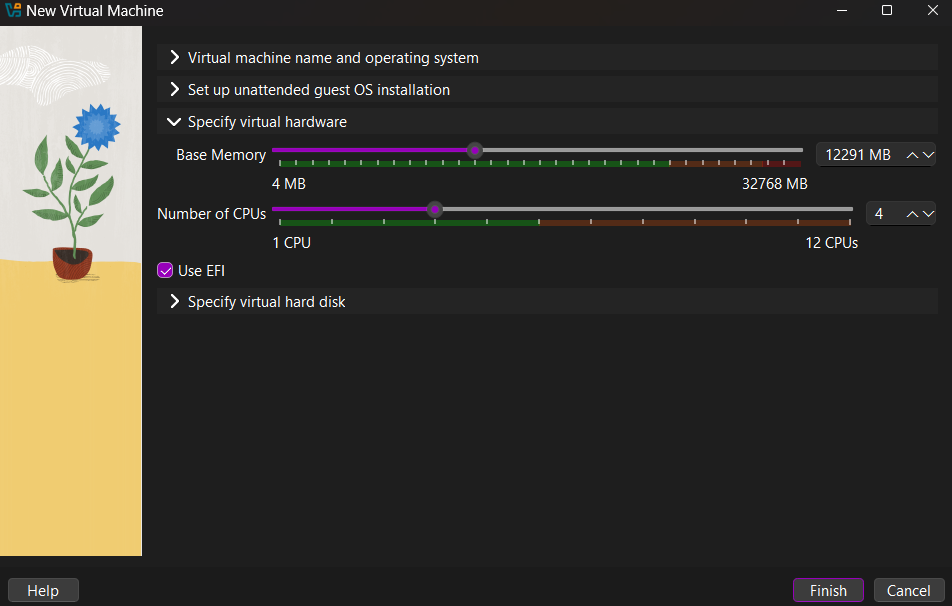
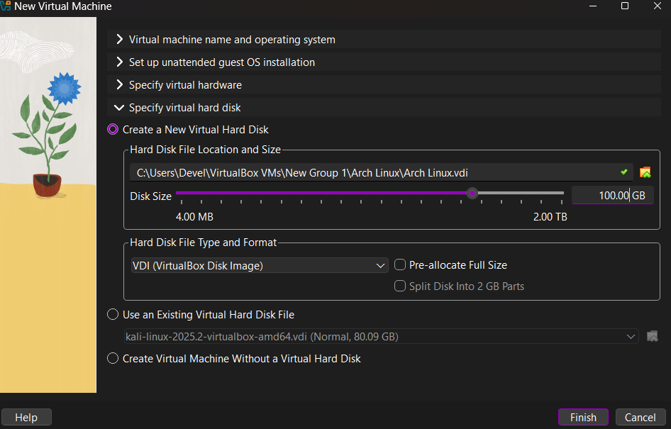
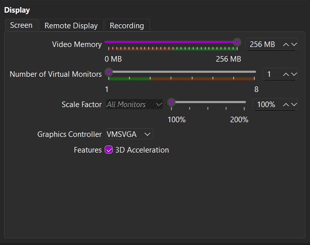
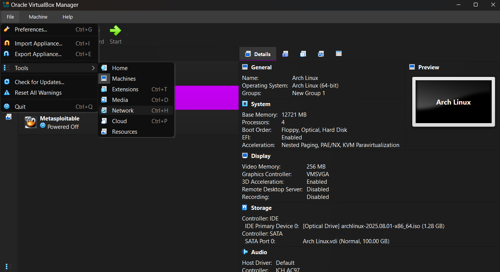

# Setting Up Your Virtual Machine

You should begin by downloading the latest version of `VirtualBox` from the [Resources](../README.md) section.
Once you have this downloaded, simply install it as you would any other program and run the software. Upon booting
the software you should see a `window` like this, minus the virtual machines already configured on the left.

Now we can begin. First, navigate to the `Arch` documentation provided in [Resources](../README.md) (I told you I wasn't going to hold your hand too much!), joking aside, I don't want to simply tell you what to do, if you are going to be a proficient `Arch` user you need to understand where to find this information and `why` we are doing what we are.

Click the `Download` button in the `navigation` bar and you will be taken to a page filled with `magnets` and `torrents`, don't do anything just yet!

> **Note:**
> A **torrent file** (`.torrent`) contains metadata: file names, sizes, folder structure, trackers, and piece hashes. You open it in a BitTorrent client, which then finds peers and downloads the content.
>
> A **magnet link** is a URL-like string (`magnet:?xt=urn:btih:...`) that encodes the torrent’s info-hash (and sometimes trackers). A client can use this directly to find peers, with no need for a separate `.torrent` file.
>
> **Key difference:** Torrent = separate file with metadata. Magnet = metadata encoded in the link. Both allow downloading the same content via BitTorrent.

Now, I presume most of you have seen a `Torrent` before. Before you go rushing off to download `bittorrent` or whatever other `P2P` tool is now popular, you don't need it.

I want you to scroll down to the bottom of the page. You should see a countries list, find your country and click the link.

Choose your preferred service, I tend to use `www.mirrorservice.org` and click into it which will navigate you
to a directory on a server. You want to download the `iso` file corresponding to your `cpu` architecture. For
`64bit` computers, download `x86_64`. If you want to verify the integrity of the file you can do so by downloading
the `.sig` file and running the command from the previous page of the `Arch` docs just above the country list.
Alternatively, if you have `powershell` access currently, you can use my `Compare-FileHash` powershell script
provided in this repository.

> **Note:**
> A **mirror service** is a server that hosts an exact copy of another server’s files, such as Linux ISOs, package repositories, or updates.
> Mirrors distribute the load, improve download speeds by providing geographically closer sources, and ensure availability if one server goes offline.
> When downloading packages or ISOs, your system chooses a mirror from the official list, often prioritising the fastest or nearest one.

So, you now have the `iso`. If you have never done this before then you are likely wondering what this is. To
keep it brief a `iso` is an archive that contains an exact copy of the data and file structure that you would find on an optical disk.

Our next step is to open up our `VirtualBox` again. Click the `New` icon to begin creating a new `Virtual Machine`.

> **Warning**
> Installing Arch in a **virtual machine** is not the same as installing on **real hardware**.
> - In a VM, Arch only sees **virtualised hardware**, making it safe to experiment since mistakes won’t affect your host system.
> - On bare-metal, Arch must interact with your **actual hardware** (GPU, Wi-Fi, audio, etc.), which may require additional drivers, firmware, or configuration.
> - Use a VM to learn safely, but expect differences when installing on your own machine.
> If you are looking to install on real hardware right now head to [Bootable USB](../chapters/TODO)

So, now simply name your `VM`, select your `iso` from wherever you downloaded it to, your distribution and `OS Version` should be automatically detected, if not, set it to `ArchLinux` and `ArchLinux(64-bit)` matching your `cpu` architecture.

> **Note**
> `Arch` actually dropped 32-bit support in 2017. If you need a 32-bit OS you need the community spinoff [Arch 32](https://archlinux32.org/). `Arch32` does follow the same setup process so yu can still follow along.

Click down into `Specify virtual hardware`. Here, you will need to make some informed decisions. If you don't know your current computer spec, check it with [speccy](https://www.ccleaner.com/speccy) before continuing. I'm presuming most of you will be working on your own PC you have either built or maintained, or at least understand your own specifications of your system. You want to provide a modest amount of `Base Memory` to the virtual machine. Depending on what you intend to use a `VM` for, and how much resources you have available on your PC, will determine the memory you should use but the `minimum` is around `4-8GB` for smooth operation since we will be installing a `Desktop Environment` and not merely interacting via the `terminal`.
If you intend to use this for heavier dev work then `8-12GB`
would be preferred, even heavier work `20+GB` however, the `host` will reserve the memory you allocate for the `VM` whilst the `VM` is actively running. This means it can indeed slow down your system if you give too much of your resources to the `VM`. I like to allocate `12GB` out of my `32GB` as I use this as a test environment to test updates and software installations before I apply them to my bare-metal install.

Then, select the number of `CPU` cores you wish to assign. I give mine about `4` cores for running a full `Desktop Environment` since I will do some minimal coding in this `VM` when testing things out.

Check the `Use EFI` box, this is required for most modern `OS`. `EFI` is three replacement for `BIOS`. It provides the `EFI System Partition` where our bootloaders will sit. It also support modern features such as larger disks (>2TB) and better hardware compatibility.

Now head to `Specify Virtual Harddisk`. You can assign as much or as little storage as you want. I'd recommend at least `20GB` to make it usable for a decent length of time. It is better to overallocate storage now than to get further in and need more. If you overallocate the `VM` will not actually use the allocated storage until you actually write to that storage. So, if you allocate `100GB` you are not immediately using that `100GB`, you are simply saying `Hey, here's the storage you can use`. If it goes unused, you lose nothing (that is, unless to pre-allocate the fullsize). Click, finish, and you have your `Virtual Box` ready, don't start it yet.

You should now see a new Box on the left side of your `VirtualBox Manager` with the name you allocated to it, right click it, and head to `settings`. The first setting
we are going to change is under `Display`, scroll to the bottom of this tab and check the box for `3D acceleration`.

> **Note**
> Enabling 3D acceleration allows `VirtualBox` to offload graphics rendering tasks to the `host GPU`. If we don't enable this all graphics rendering will be handled in software making our graphical experience in `Desktop Environments` feel laggy or unresponsive. The tradeoff is, it isn't perfect, some graphical content simply won't work properly, but, for our experiment we just care about the `OS` working and testing that the overall `OS` does not break before we install updates on our bare-metal OS.

With that enabled, go ahead and increase the `Video memory` to the maximum value. If you wish to use multiple monitors, change Number of virtual monitors if your system can handle it. Since we aren't going to be `SSHing` into this box we can ignore other settings here.

Next, head back to `General`. Head to the `Processor` tab and enable `PAE/NX`.

> **Note**
> **PAE (Physical Address Extension)** and **NX (No-eXecute)** are CPU features you can enable in VirtualBox to improve compatibility and security:
>
> * **PAE** allows 32-bit operating systems to access more than 4 GB of RAM (up to 64 GB). It’s mostly relevant if you ever run a 32-bit guest; modern 64-bit Arch doesn’t need it, but enabling it does no harm.
> * **NX** (also called XD, Execute Disable) marks areas of memory as non-executable, helping prevent certain classes of exploits (like buffer overflow attacks). Modern Linux kernels expect this to be available.
> In practice: You enable PAE/NX in VirtualBox so your guest OS can use these CPU features just like real hardware would. For Arch (64-bit), NX is the important one; PAE is more about legacy support.

Hit `Ok` and we can not set up our network. `VirtualBox` allows us to communicate with the internet by default. However, our box will be hidden from our local network and other boxes. If we want to make communication available with our box from our local network we need to set up a `virtual network`. Hit `CTRL+H` (or nav to File -> tools -> network).

Once in the `Network` window head over to the `Nat Networks` tab. Select `Create` to create a new network, name it something you will recognise, and give it a `IPv4` address range (192.168.200.0/24) is fine if you don't know much networking. `Enable DHCP` and you are free to hit `Apply`.

Navigate back to the settings on your `Arch Linux` VM. This time, head to the `network` tab and select `NatNetwork`, then select your new `network` under `Attached to`. There we have it, now we will have both `internet` and `local` network access.

Right click your `VM` and click `Start with GUI`. Click into the `VM` window and hit `Enter` to select the first option on the `iso` boot option list. You should see a screen as below. Congratulations, we are now ready to begin installing `Arch`.

| [← Previous](../README.md) | [Next →](#next) |
|:--|--:|
