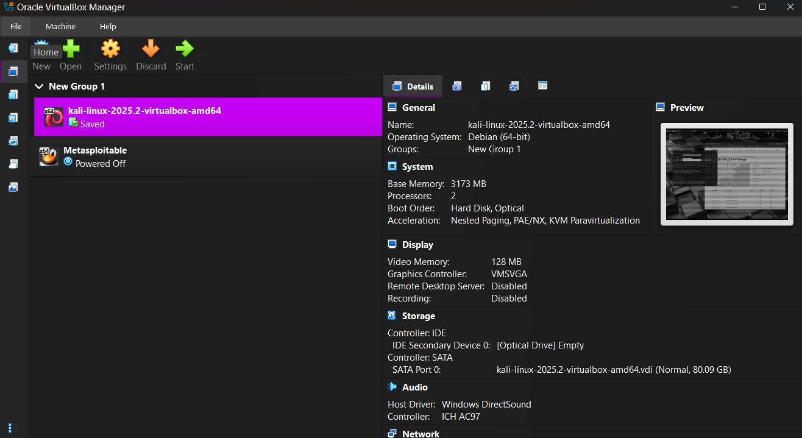
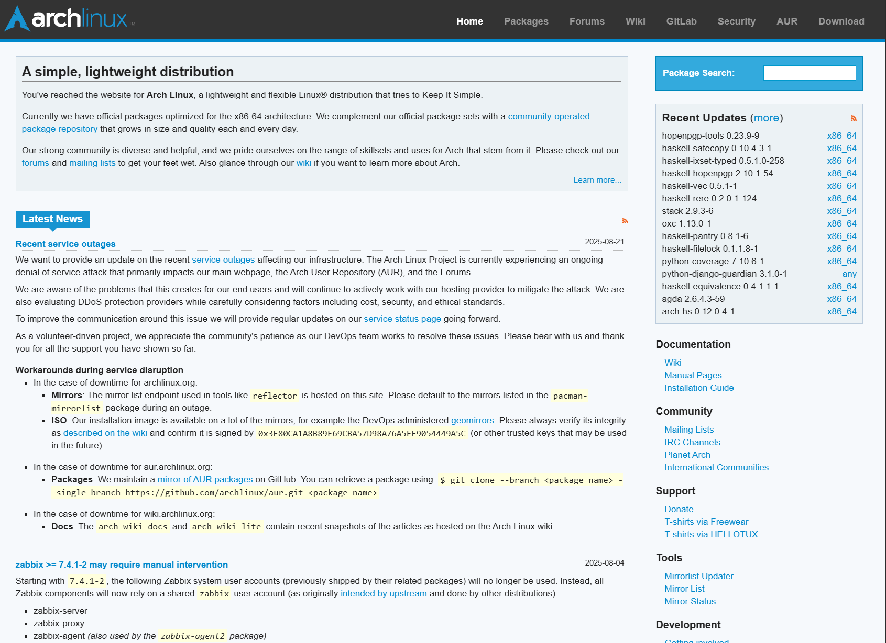
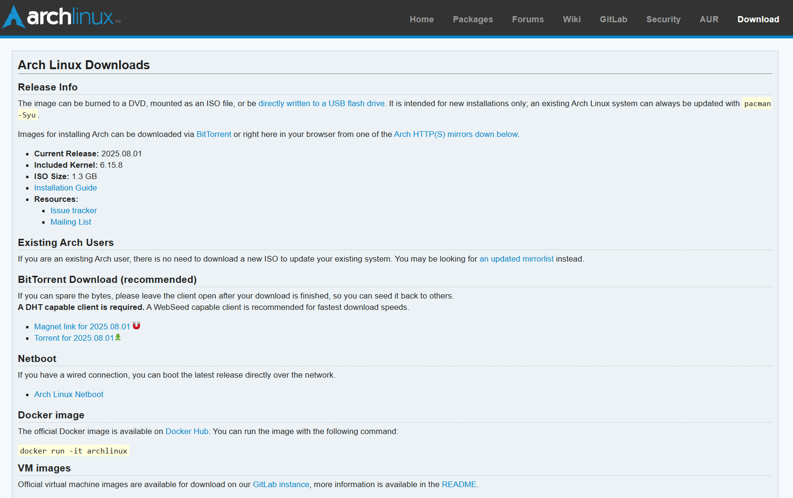
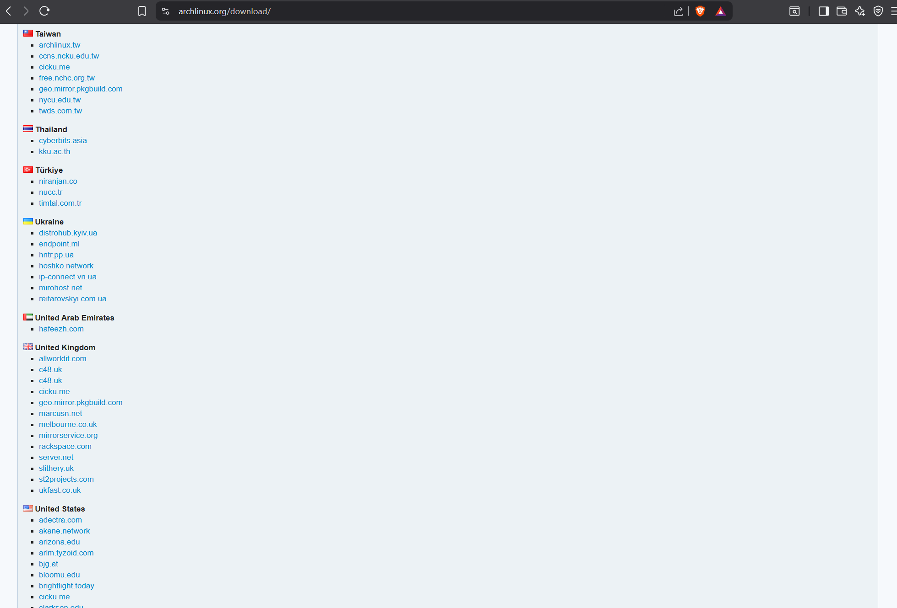
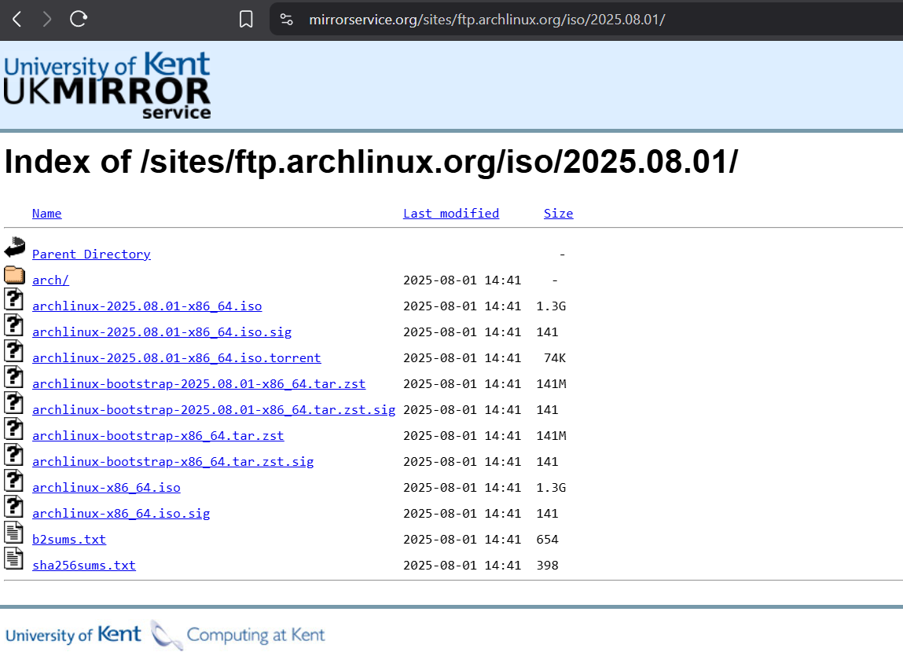

# Setting Up Your Virtual Machine

You should begin by downloading the latest version of `VirtualBox` from the [Resources](../README.md) section.
Once you have this downloaded, simply install it as you would any other program and run the software. Upon booting
the software you should see a `window` like this, minus the virtual machines already configured on the left.

Now we can begin. First, navigate to the `Arch` documentation provided in [Resources](../README.md) (I told you I wasn't going to hold your hand too much!), joking aside, I don't want to simply tell you what to do, if you are going to be a proficient `Arch` user you need to understand where to find this information and `why` we are doing what we are.

Click the `Download` button in the `navigation` bar and you will be taken to a page filled with `magnets` and `torrents`, don't do anything just yet!

> **Note:**
> A **torrent file** (`.torrent`) contains metadata: file names, sizes, folder structure, trackers, and piece hashes. You open it in a BitTorrent client, which then finds peers and downloads the content.
>
> A **magnet link** is a URL-like string (`magnet:?xt=urn:btih:...`) that encodes the torrent’s info-hash (and sometimes trackers). A client can use this directly to find peers, with no need for a separate `.torrent` file.
>
> **Key difference:** Torrent = separate file with metadata. Magnet = metadata encoded in the link. Both allow downloading the same content via BitTorrent.

Now, I presume most of you have seen a `Torrent` before. Before you go rushing off to download `bittorrent` or whatever other `P2P` tool is now popular, you don't need it.

I want you to scroll down to the bottom of the page. You should see a countries list, find your country and click the link.

Choose your preferred service, I tend to use `www.mirrorservice.org` and click into it which will navigate you
to a directory on a server. You want to download the `iso` file corresponding to your `cpu` architecture. For
`64bit` computers, download `x86_64`. If you want to verify the integrity of the file you can do so by downloading
the `.sig` file and running the command from the previous page of the `Arch` docs just above the country list.
Alternatively, if you have `powershell` access currently, you can use my `Compare-FileHash` powershell script
provided in this repository.

> **Note:**
> A **mirror service** is a server that hosts an exact copy of another server’s files, such as Linux ISOs, package repositories, or updates.
> Mirrors distribute the load, improve download speeds by providing geographically closer sources, and ensure availability if one server goes offline.
> When downloading packages or ISOs, your system chooses a mirror from the official list, often prioritising the fastest or nearest one.

So, you now have the `iso`. If you have never done this before then you are likely wondering what this is. To
keep it brief a `iso` is an archive that contains an exact copy of the data and file structure that you would find on an optical disk.

Our next step is to open up our `VirtualBox` again. Click the `New` icon to begin creating a new `Virtual Machine`.

> **Warning**
> Installing Arch in a **virtual machine** is not the same as installing on **real hardware**.
> - In a VM, Arch only sees **virtualised hardware**, making it safe to experiment since mistakes won’t affect your host system.
> - On bare-metal, Arch must interact with your **actual hardware** (GPU, Wi-Fi, audio, etc.), which may require additional drivers, firmware, or configuration.
> - Use a VM to learn safely, but expect differences when installing on your own machine.
> If you are looking to install on real hardware right now head to [Bootable USB](../chapters/TODO)

So, now simply name your `VM`, select your `iso` from wherever you downloaded it to, your distribution and `OS Version` should be automatically detected, if not, set it to `ArchLinux` and `ArchLinux(64-bit)` matching your `cpu` architecture.

> **Note**
> `Arch` actually dropped 32-bit support in 2017. If you need a 32-bit OS you need the community spinoff [Arch 32](https://archlinux32.org/). `Arch32` does follow the same setup process so yu can still follow along.

| [← Previous](../README.md) | [Next →](#next) |
|:--|--:|
