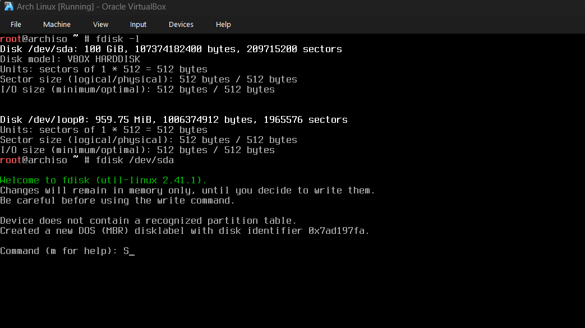
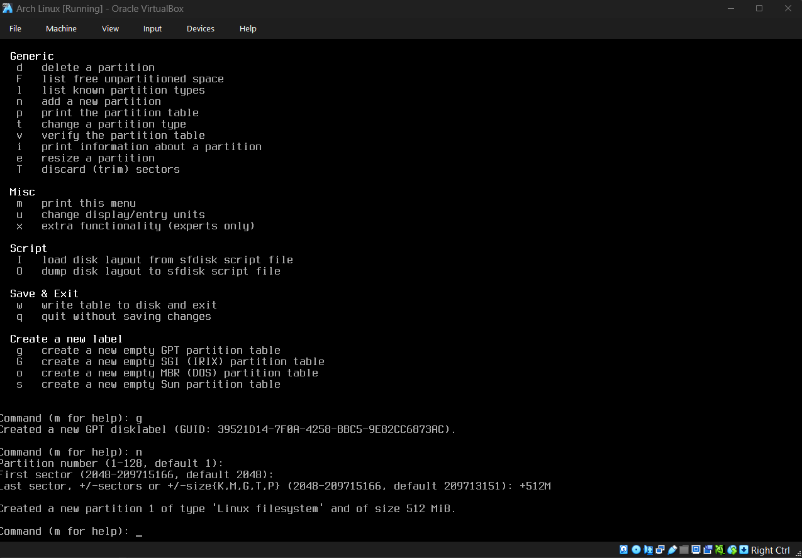
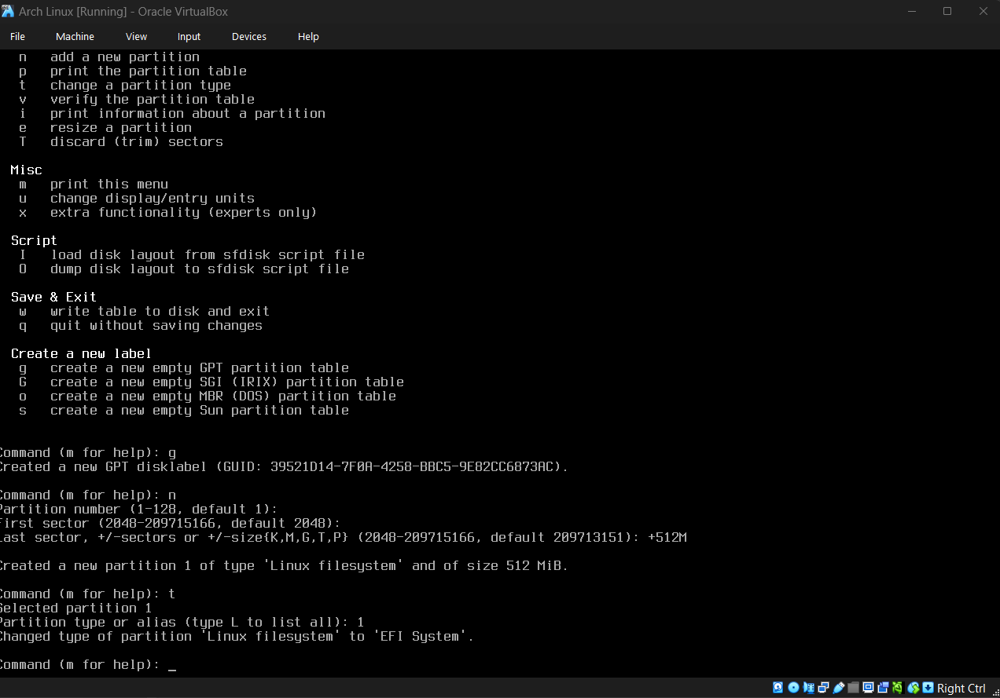
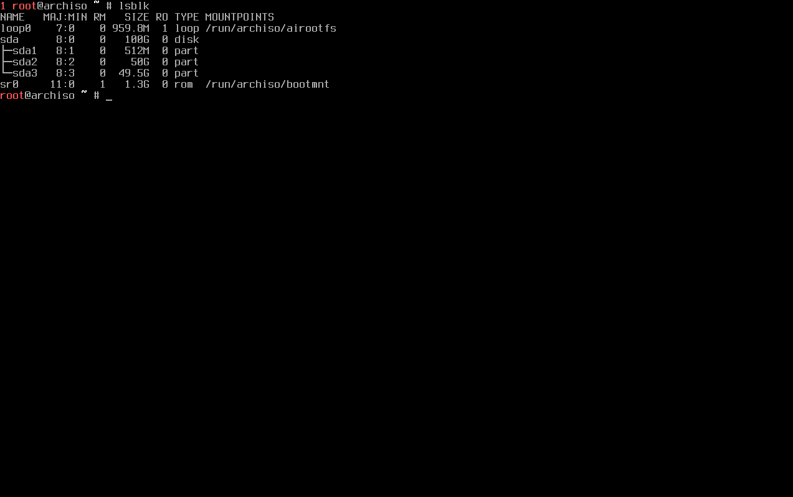
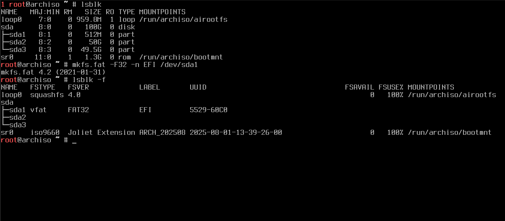
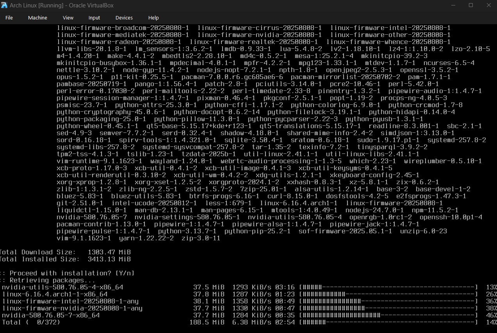

# Installation

Congratulations, you mounted the `iso`, either via your `USB` or `VM` and you are now greeted with the `Bash` shell. First, in the `Arch` docs navigate to the `Wiki` page.


## Keyboard Localisation

The first you will likely notice is some of your keyboard keys don't align with what is entered in the terminal. We need to do is find your `keymap` in the system. This will be the map for your specific keyboard localisation. You can find all included `keymaps` via the command:

```
# localectl list-keys
```

Find the corresponding `keymap` for your keyboard (in my case it is `uk`) and remember it. Then run:

```
loadkeys <keymap>
```

We can also set fonts. To check available console fonts we can `ls` the file inside `/usr/share/kbd/consolefonts`. I quite like the `ter` font so I will stick with that but boost it to a `118b` font-size.

```
setfont ter-u18b
```

## Verify boot mode

Now, if you already know which `boot mode` you are in, for instance `64bit vs 32bit` you can skip this check, if you do not however run:

```
 cat /sys/firmware/efi/fw_platform_size
```

You should see `64` or `32` if it booted in `UEFI` mode, if you see nothing it booted in `BIOS` mode and you need to refer to your motherboards manual to enable `UEFi`.

## Connect to the internet

Ensure your `network interface` is available.

```
ip link
```

You should see a `loopback` and your ethernet connection (if wired). If you are using `wireless` or `WWAN` then we need to set up your wireless adapter, I may cover this at a later date in a separate section if I do an installation on a laptop again, For now, refer to [this](https://wiki.archlinux.org/title/Iwd#iwctl) page of the docs. verify your connection by `pinging` the address `ping.archlinux.org`.

## System Clock

`systemd-timesyncd` should be enabled by default. You can check the time with `timedatectl`. If you are living under `UTC` this should be correct, however,
I am on `BST` as of right now, so we are going to cover changing the local time, this will wait until after installation as anything we do now is in a temporary state, only installation changes will be carried over from this temporary environment so there is no point configuring anything we don't need to yet as it will be lost on `reboot`.


## Partition the disks

Now we need to `partition` our disks. You should see two disks. The `loop` disk is where the `Arch.iso` is mounted and `/dev/sda` is our hard disk. Use `fdisk -l` to
check that the disks you are partitioning are aligned. This means that the disks should be multiples of the same number for their `sector size` e.g. `512` or `4096`.
Here is a quick reference for partition alignment:

| Logical / Physical Sector Size | Alignment Rule                          | Notes                                      |
|--------------------------------|-----------------------------------------|--------------------------------------------|
| 512 / 512                      | Any sector                              | Legacy disks, VirtualBox VMs               |
| 512 / 4096                     | Start sector must be multiple of 8      | “512e” drives (4K physical, 512 logical)   |
| 4096 / 4096                    | Start sector must be multiple of 1 (4K) | True 4K native drives                      |

**Tip:** Modern tools (`fdisk`, `parted`) default to starting partitions at **sector 2048**, which is divisible by both 512 and 4096 ensuring safe alignment across all drives.

We can then run fdisk on the disk we want to partition, in my case `/dev/sda`:

```
fdisk <disk>
```

At this point you should be greeted with the `Welcome to fdisk`.



You can press `m` to check what command options you have, see if you can work out what we are about to do
for yourself, nothing is committed until we hit `w` to write the partition table to the disk, so don't worry.

If you've done that, feel free to continue, or even read on and see if your actions matched.
I would begin by entering `F` to check the space available to me on my partition.

So, the first question is then, what partitions do we need, and how do we divide up our memory?
We need a `root` partition to hold the operating system. We also need a `EFI` partition the store our
bootloader, I will be using `GRUB` but you can check which one to use [here](https://wiki.archlinux.org/title/Arch_boot_process).

You can include a `swap` partition, it is recommended on bare-metal systems as to prevent memory overflows, however,
in a `VM` you will usually just use a `swap file` on the system itself. Since we want this to be almost identical to
the bare-metal system we will be creating a `swap` of `4GB` in the form of a `swap file`. If you want to use `hibernation` note that you MUST
create a `swap partition` and provide enough swap memory to match the size of your `RAM`. This is meaningless for a `VM` so i will not be doing this
but if you are installing this on a `laptop` and want to hibernate be sure to match your `RAM`.

Whilst not `required` I will be including a `/home` partition. This is to separate the `root` partition. This allows us to reinstall `Arch` later and keep our `/home` partition preserving our files. This level of `isolation` is nice for `Arch` particularly because if one of our partitions fills up `/var` it won't break the entire system. With a single `root` partition a full disk can prevent `Linux` from even booting at all. It also gives us greater flexibility with permissions, security, encryption...
If you were running a server you'd likely want a `/srv` partition so that you can run that partition with locked down
permissions, preventing executions of certain binaries etc...

| Partition        | Mount Point | Size Recommendation     | Required / Recommended | Notes                                                                 |
|------------------|-------------|-------------------------|-------------------------|----------------------------------------------------------------------|
| Root             | `/`         | 20–30 GiB minimum (more if installing DE/apps) | **Required**          | Contains the operating system and all installed software.             |
| EFI System Part. | `/boot/efi` | 300–550 MiB (FAT32)     | **Required (UEFI only)** | Needed for UEFI systems; stores bootloader (e.g. GRUB).               |
| Swap             | N/A         | Equal to RAM (if using hibernation) or 1–4 GiB otherwise | **Recommended** (not strictly required) | Provides extra memory; required for hibernation, optional otherwise. |

**Tip:**
- If you’re using a VM, you can skip swap and just use a swap file later.
- On bare-metal, swap is **strongly recommended**, especially for laptops.
- For modern hardware, use at least 512 MiB EFI, 30–50 GB root, and additional partitions for `/home` or `/data` if desired.

So, we will press `g` to create our new `GPT `partition table. We can then use `n` to create our first `partition`.
We can press `enter` to leave this partition number as `1`. Enter again to for our `first sector` starting address, `fdisk`
automatically puts it to the end of the last sector to prevent overlapping of partitions. For last sector we need to define
the size. We can do this via the '+' operator and the 'M' descriptor as below.



Notice how, whilst we now have a partition, it is of type `Linux Filesystem`. If this were `root` that would be fine,
however, this is our `EFI` partition and so we need to change the type. We can do so with `t`. You can list the
types available with `L` or simply press `1` and `enter`.



That is our `EFI` partition sorted. Now you just need to repeat this for your other partitions, changing the size
to the size of partition you want for each. The others should be `Linux Filesystem`, which is the default anyway.
If you want to create a `swap partition` the process is exactly the same, we simply change the type to `Linux swap`.
We will be adding a `swap file` later. Since we don't need hibernation in this case a `swap file` performs almost
identically on modern `kernels` and is far more flexible. For your final partition to fill the rest of memory you
can simply press `enter` and let the second section default.

When you are done simply verify the partition table `v` and write it to disk `w`.

## Formatting the partitions

Now we have created our partitions they need formatting with an appropriate `file system`. Our filesystem
defines how we write data to our drive. It determines our filesystem structure: files, directories, metadata
are all structured. Since we are using `UEFI` out `UEFI` partition MUST use a `FAT 32` filesystem as `UEFI`
firmware only understands `FAT32` bootloaders. You can experiment with the other `filesystems` for other `Linux Filesystem`
partitions, however, for a reliable and table version I would recommend `ext4` which is the usually `Linux` default.
Here however,I will be using `Btrfs`. Whilst it compromises on some reliability `Btrfs` will make restoring snapshots
later much more reliable, though we will need to do plenty of tweaking for performance. If you want simplicity, and
a system that you can just "set and forget" choose `ext4`, otherwise, join me and we will configure snapshots later.



Okay, so you've selected your `filesystem` and are ready to `format`. The `Arch` docs can be a little unclear
here with how to run the `mkfs` commands for certain formats, so, we will begin with out `EFI` partition.

```
mkfs.fat -F32 -n EFI /dev/sda1
```



You should now be able to check your formatted partition using `lsblk -f` (f procides the filesystem).
formatting by `ext4` is straightforward `mkfs.ext4`.

Great, we have our `EFI` partition formatted in a `FAT32` format. Now we just need to format our other
partitions in the `Btrfs` format.

```
mkfs.btrfs -L ROOT /dev/sda2
```

It can be a little confusing to work out the commands for different filesystems, but you always have the `man` page
and the `Arch` docs. In this case, both of these commands not only format but also label their partitions.
We have an additional argument for `FAT32` because we have to provide the `F32` argument to ensure it is the correct
`FAT` variant whilst `-L` and `-n` do the same thing of labelling the partition for different filesystem commands.

Using labels will not only help our snapshotting later, especially the `ROOT` label, but will also make our `fstab`
cleaner and easier to identify.

> **Note**
> If you created a swap partition you need to also run `mkswap` on the partition to initialize it.

# Mounting the file systems

Great, you made it this far. Now we can mount our `filesystems`.
Firstly, we need to mount our `ROOT` volume to `/mnt`. This is a placeholder in our `iso` for now, but
once we install `Arch` the `/mnt` directory will become `/` for our new system. In `Linux` everything is a
file, and so we organise our filestructure through a file tree with `/` or `ROOT` at the base. Without a `ROOT`
partition the kernel has no filesystem to boot into. So `/mnt` will become the anchor for our whole file heirarchy.
You can read a little more about the `Linux Filesystem` [here](../chapters/linux_philosophy_and_filesystem.md) or
[here](https://github.com/Summoned-Archfiend/LinuxInDepth/blob/master/chapters/3_fileSystemHeirarchy.md).

```
mount /dev/sda2 /mnt
```

Before we do anything else, we now want to configure our `Btrfs` volumes. To do so we use the `subvolume` command.

```
btrfs subvolume create /mnt/@
btrfs subvolume create /mnt/@snapshots
```

We then use `umount` to dismount our `/mnt` directory and remount it with the following comannds:

```
mkdir /mnt/.snapshots
mount -o noatime,ssd,compress=zstd,space_cache=v2,subvol=@snapshots /dev/sda2 /mnt/.snapshots
```

We can then mount our other partitions. If you have a second `Btfs` partition you can either create
snapshots or simply mount the partition as a whole.

> **Note**
> The above will give you a basic snapshot configuration. However, if you want something a little more
> robust this is the snapshot sequence I will be following for my bare-metal installation. The below table
> deatails each snapshot, the frequency, and reasoning. This is a bit more work but it provides a snapshot
> system similar to how SteamOS operates. This means we can backup our main OS without affecting our files,
> we can backup games if needed (for instance modded instances), and we can back up VMs before large experiments
> across multiple VMs. 

| Drive                    | Subvolume                                          | Snapshot Frequency                    | Purpose / Notes                                                                                                      |
| ------------------------ | -------------------------------------------------- | ------------------------------------- | -------------------------------------------------------------------------------------------------------------------- |
| **ROOT (476 GB)**        | `@` (root)                                         | Before updates (daily/weekly)         | Protect system from bad Arch updates. Roll back OS while keeping user data intact.                                   |
|                          | `@home` (user configs, dotfiles, saves, some mods) | Weekly or before major config changes | Safety net for user configs and mod managers. Useful if you break desktop/WM settings or mod configs.                |
|                          | `@snapshots`                                       | *Container only*                      | Stores snapshots for `@` and `@home`. Not snapshot-worthy itself.                                                    |
|                          | (optional) `@var`                                  | Rarely, or exclude from snapshots     | Logs, caches, pacman package cache. Usually excluded to avoid bloat.                                                 |
| **SSD (1.81 TB, fast)**  | `@games_fast`                                      | Rare / none                           | Steam games that can be redownloaded. Snapshot not useful.                                                           |
|                          | `@games_modded`                                    | Before modding sessions               | Captures working state of modded installs (Skyrim, Fallout, etc.). Lets you revert instantly after bad mods/updates. |
|                          | `@vms`                                             | Before big experiments                | VM images change rapidly. Snapshot before OS upgrades or major test changes. Consider disabling CoW for speed.       |
|                          | (optional) `@projects`                             | As needed (weekly/during dev sprints) | Development projects/code/data. Snapshots can act as versioned backups alongside git.                                |
| **SSHD (1.81 TB, bulk)** | `@games_bulk`                                      | None                                  | Bulk/less demanding games. Easily redownloadable. Snapshots waste space here.                                        |
|                          | `@media`                                           | None                                  | Movies/music don’t need rollback. Better to just back up externally.                                                 |
| **External (2 TB)**      | (NTFS/exFAT now)                                   | N/A until reformatted                 | Mount as is to copy data in. If reformatted to Btrfs later → use for backups (monthly snapshots).                    |


### Btrfs Mount Options Explained

| Option             | Meaning                                                                 | Why it’s used in Arch setup                          |
|--------------------|-------------------------------------------------------------------------|------------------------------------------------------|
| `noatime`          | Disables updating file *access time* (`atime`) on every read.           | Reduces unnecessary disk writes → improves SSD lifespan and performance. |
| `ssd`              | Optimises Btrfs for solid-state drives (wear leveling, TRIM, etc).      | Helps with performance and longevity on SSDs/NVMe.   |
| `compress=zstd`    | Enables transparent compression using Zstandard.                       | Saves disk space, often improves speed since CPUs compress faster than disks write. |
| `space_cache=v2`   | Uses the newer free space caching method.                              | Speeds up allocation decisions, improves performance. |
| `subvol=@`         | Tells Btrfs to mount the subvolume named `@` instead of the whole FS.  | Ensures only your root subvolume is mounted at `/`.  |

**Summary:**
This command mounts your Btrfs root (`/dev/sda2`) at `/mnt` with optimisations for SSD, less wear, compression enabled, faster space management, and only the `@` subvolume visible as `/`.


Lastly, we want to mount our `EFI` system in `/mnt/boot/efi` if this does not exist you need to create it via `mkdir`.

> **Note**
> If you created a `swap` partition now is the time to run `swapon` to enable it.

# Install packages

Whilst you can get away with only the essential packages of: `base linux linux-firmware` I have included
a few more, feel free to use either but if you have a `nvidia GPU` I have included the packages for that
plus some additional tools like `git` and `base-devel` which makes installing packages from `AUR` (like vscode)
much easier later. Please remove `nvidia, intel, and rgb` related packages if you do not have these components
in your build.

```
pacstrap /mnt \
  base linux linux-firmware \
  vim less man-db man-pages \
  curl openssh \
  btrfs-progs dosfstools e2fsprogs mtools \
  intel-ucode sof-firmware alsa-utils pipewire pipewire-alsa pipewire-pulse pipewire-jack \
  bluez bluez-utils \
  base-devel git zip unzip p7zip pacman-contrib \
  htop neofetch bash-completion lm_sensors nvtop \
  nvidia nvidia-utils nvidia-settings \
  openrgb liquidctl \
  nodejs npm python python-pip
```

Now, simply wait for your installs.



Once this completes we simply need to generate out `fstab`

```
genfstab -U /mnt >> /mnt/etc/fstab
```

This is a file system table that tells `Linux`:
- Which partitions, subvolumes, or devices to mount at boot.
- Where to mount them in the filesystem tree
- With what options (read-only, compression, atime settings, etc.)

Notice how, we are running `genfstab` with `-U` this tells `fstab` to generate an `fstab` with `uuids`. This is better
than the `L` option as it avoids conflicts. Labels are not as stable as they are not always unique and may conflict.
We also then direct the output `>>` from `stdout` nto the `fstab` file location with an append, this is because `fstab`
generates more than once and we don't want to accidentally wipe the file.

# Chroot

We can now enter the system using `arch-chroot /mnt`

This means we can now set out local time:

```
ln -sf /usr/share/zoneinfo/Europe/London /etc/localtime
hwclock --systohc
```

# Network Time Protocol

We can now enable `NTP`

```
timedatectl set-ntp true
```

and verify with: `timedatectl status`

# Localisation

We simply need to edit the file `/etc/locale.gen` and uncomment the `UTF-8` locales we want
to use. We can do this via `vim` (if you used my install packages) or `vi` or any other
tool you may have installed for text editing.

```
vi /etc/locale.gen
```

> **Tip** you can search in vim by typing `/<searchterm>`
Then, generate the locales: `locale-gen`

You can then also set your `keymap` so we don't lose it when we `reboot` by editing
`/etc/vconsole.conf`

and adding your keymap and font from earlier.

```
KEYMAP=uk
FONT=ter-u18b
```

Finally, edit `/etc/hostname` and give your system an identifiable name.

send a `ping` request to check your network is working, and we should be done with that. If
you encounter an issue here then you will need to revisit the network docs.

Simply set a root password via: `passwd`

and we are onto the final step of installing our `bootloader`.


| [← Previous](../chapters/1_virtual_machine.md) | [Next →]() |
|:--|--:|
