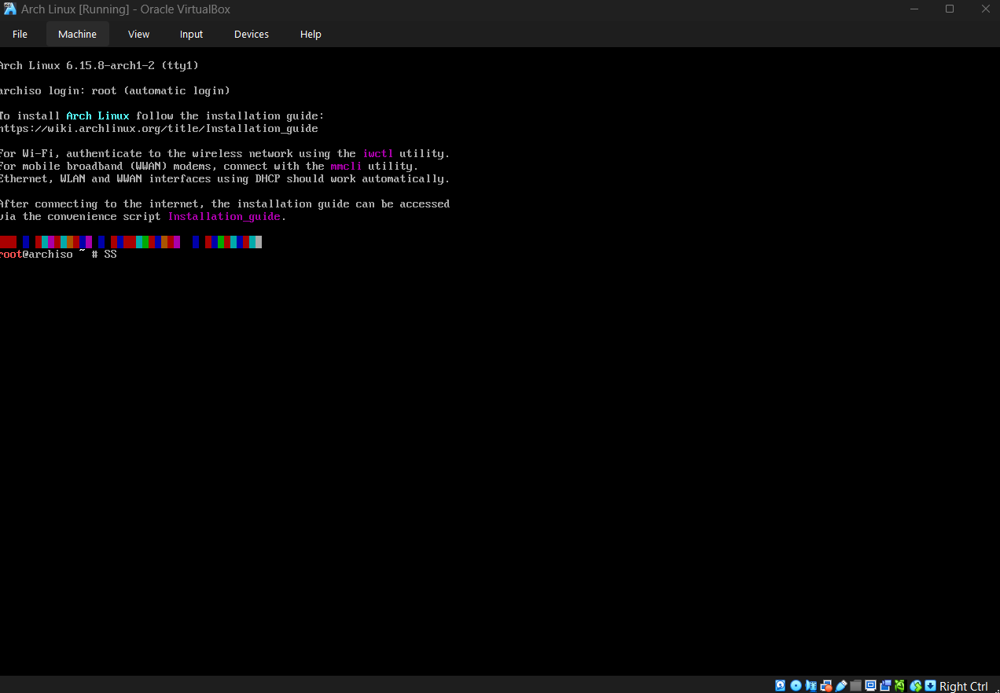
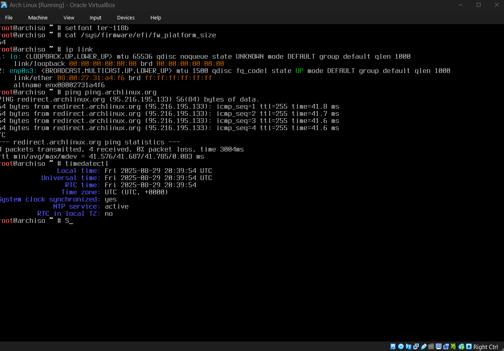

# Installation

Congratulations, you mounted the `iso`, either via your `USB` or `VM` and you are now greeted with the `Bash` shell. First, in the `Arch` docs navigate to the `Wiki` page.



---

## Keyboard Localisation

The first thing you will likely notice is some of your keyboard keys not aligning with what is entered in the terminal. We need to find your `keymap` in the system. This will be the map for your specific keyboard localisation. You can find all included `keymaps` via the command:

```
localectl list-keymaps
```

Find the corresponding `keymap` for your keyboard (in my case it is `uk`) and remember it. Then run:

```
loadkeys <keymap>
```

You can also set fonts. To check available console fonts, `ls` the files inside `/usr/share/kbd/consolefonts`. For example:

```
setfont ter-u18b
```

> **Note**
> If `setfont ter-u18b` fails, list available fonts with `ls /usr/share/kbd/consolefonts` and choose one that exists.

---

## Verify boot mode

If you already know which boot mode you are in, for instance `UEFI` vs `BIOS`, you can skip this step. Otherwise run:

```
cat /sys/firmware/efi/fw_platform_size
```

You should see `64` or `32` if it booted in UEFI mode. If you see nothing it booted in BIOS mode, and you need to refer to your motherboard manual to enable UEFI.

---

## Connect to the internet

Ensure your network interface is available:

```
ip link
```

You should see a loopback and your ethernet connection if wired.

### If using Wi-Fi

If you do not have a wired connection, you can connect using `iwd` (`iwctl`):

```
iwctl
```

Inside the interactive prompt:

```
# list devices
device list

# scan for networks (replace wlan0 with your device name)
station wlan0 scan

# show available networks
station wlan0 get-networks

# connect to your SSID
station wlan0 connect <SSID>
```

You will be prompted for your Wi-Fi password. After connection, verify with:

```
ping archlinux.org
```

Exit the prompt with:

```
exit
```

For full details, see the [Iwd docs](https://wiki.archlinux.org/title/Iwd#iwctl).

> **Note**
> If DNS fails, try `ping 1.1.1.1`. If that works, you have DNS resolution issues. Check `resolvectl status`.

---

## System Clock

`systemd-timesyncd` should be enabled by default. You can check the time with `timedatectl`. For now, only basic verification is needed, as permanent configuration will happen later inside the installed system.



---

## Partition the disks

Use `fdisk -l` to see your disks. The `loop` device is the ISO, your target drive is usually `/dev/sda`.

Partition alignment rules:

| Logical / Physical Sector Size | Alignment Rule                          | Notes                                  |
| ------------------------------ | --------------------------------------- | -------------------------------------- |
| 512 / 512                      | Any sector                              | Legacy disks, VirtualBox VMs           |
| 512 / 4096                     | Start sector must be multiple of 8      | 512e drives (4K physical, 512 logical) |
| 4096 / 4096                    | Start sector must be multiple of 1 (4K) | True 4K native drives                  |

Modern tools default to starting partitions at sector 2048 which ensures safe alignment.

Run `fdisk <disk>` (example: `/dev/sda`).

Partitions needed:

* Root partition `/` for the operating system.
* EFI partition `/boot/efi` for the bootloader.
* Optional swap partition if you want hibernation (size equal to RAM). Otherwise use a swap file.
* Optional `/home` partition to keep data separate from the OS.

Recommended sizes:

| Partition        | Mount Point | Size Recommendation                       | Required / Recommended | Notes                                           |
| ---------------- | ----------- | ----------------------------------------- | ---------------------- | ----------------------------------------------- |
| Root             | `/`         | 30–50 GiB typical with a DE               | Required               | Contains the operating system and all software. |
| EFI System Part. | `/boot/efi` | 512 MiB (FAT32)                           | Required (UEFI only)   | Needed for UEFI bootloaders.                    |
| Swap             | N/A         | Equal to RAM if hibernating, else 1–4 GiB | Recommended            | Required for hibernation, optional otherwise.   |

> **Note**
> If you plan on multiple desktop environments or lots of packages, allocate 80–100 GiB to root for comfort.

If you create a swap partition, you will initialise it later with `mkswap` and enable with `swapon`.

---

## Formatting the partitions

Format the EFI partition as FAT32:

```
mkfs.fat -F32 -n EFI /dev/sda1
```

Format root as Btrfs:

```
mkfs.btrfs -L ROOT /dev/sda2
```

Check with:

```
lsblk -f
```

If you created a swap partition initialise it with:

```
mkswap /dev/sdX
swapon /dev/sdX
```

> **Note**
> Labels help produce a cleaner `fstab`. We label root as `ROOT` which is useful later when identifying snapshots.

---

## Mounting the filesystems

### 1) Mount root temporarily and create subvolumes

```
mount /dev/sda2 /mnt
btrfs subvolume create /mnt/@
btrfs subvolume create /mnt/@snapshots
# optional but useful to keep snapshots lean
btrfs subvolume create /mnt/@var
umount /mnt
```

### 2) Mount root subvolume with options

```
mount -o noatime,ssd,compress=zstd:3,subvol=@ /dev/sda2 /mnt
mkdir -p /mnt/.snapshots /mnt/var
mount -o noatime,ssd,compress=zstd:3,subvol=@snapshots /dev/sda2 /mnt/.snapshots
mount -o noatime,ssd,compress=zstd:3,subvol=@var       /dev/sda2 /mnt/var
```

### 3) Prepare and mount HOME from a second Btrfs partition

Create subvolumes using a temporary mount so you do not clash with the install tree:

```
mkdir -p /mnt/home-temp
mount /dev/sda3 /mnt/home-temp
btrfs subvolume create /mnt/home-temp/@home
btrfs subvolume create /mnt/home-temp/@projects
btrfs subvolume create /mnt/home-temp/@games_modded
btrfs subvolume create /mnt/home-temp/@vms
umount /mnt/home-temp
```

Now mount the HOME subvolumes into the install tree:

```
mkdir -p /mnt/home /mnt/home/projects /mnt/home/games_modded /mnt/home/vms
mount -o noatime,ssd,compress=zstd:3,subvol=@home         /dev/sda3 /mnt/home
mount -o noatime,ssd,compress=zstd:3,subvol=@projects     /dev/sda3 /mnt/home/projects
mount -o noatime,ssd,compress:zstd:3,subvol=@games_modded /dev/sda3 /mnt/home/games_modded
mount -o noatime,ssd,compress=zstd:3,subvol=@vms          /dev/sda3 /mnt/home/vms
```

### 4) Mount the EFI System Partition (ESP)

The EFI partition is required for UEFI boot. Create the directory inside your install tree and mount it:

```
mkdir -p /mnt/boot/efi
mount /dev/sda1 /mnt/boot/efi
```

Verify:

```
findmnt -R /mnt
```

You should see `/`, `/.snapshots`, `/var`, `/home` (and its subvolumes), and `/boot/efi`. This ensures everything is ready before generating fstab.

> **Common Issue**
> If you mount to `/boot/efi` without the `/mnt` prefix, you are mounting into the ISO’s root, not the install tree. Always mount inside `/mnt`.

---

## Install packages

Install the base system and extras:

```
pacstrap /mnt \
  base linux linux-firmware \
  vim less man-db man-pages \
  curl openssh \
  btrfs-progs dosfstools e2fsprogs mtools \
  intel-ucode sof-firmware alsa-utils \
  pipewire pipewire-alsa pipewire-pulse pipewire-jack \
  bluez bluez-utils \
  base-devel git zip unzip p7zip pacman-contrib \
  htop bash-completion lm_sensors nvtop \
  nvidia nvidia-utils nvidia-settings \
  openrgb liquidctl \
  nodejs npm python python-pip
```

If `genfstab` is not available, install it with:

```
pacman -Sy --needed arch-install-scripts
```

Generate `fstab` (ignoring any `/mnt/home-temp` leftovers):

```
genfstab -U /mnt | sed '/home-temp/d' > /mnt/etc/fstab
```

---

## Chroot

Enter the new system:

```
arch-chroot /mnt
```

Set timezone:

```
ln -sf /usr/share/zoneinfo/Europe/London /etc/localtime
hwclock --systohc
```

Enable NTP:

```
timedatectl set-ntp true
```

Verify with:

```
timedatectl status
```

---

## Localisation

Edit `/etc/locale.gen` and uncomment the UTF-8 locales you need:

```
vi /etc/locale.gen
```

Generate locales:

```
locale-gen
```

Set keymap and font in `/etc/vconsole.conf`:

```
KEYMAP=uk
FONT=ter-u18b
```

Set hostname:

```
echo myhostname > /etc/hostname
```

Set root password:

```
passwd
```

Now install your bootloader (GRUB or alternative).

---

## Bootloader Installation (GRUB on UEFI)

At this point, we have a working base system with packages installed, a root password set, and the correct locales configured. The last major step before reboot is installing the bootloader.

We will use **GRUB** with UEFI support.

### 1) Install GRUB and EFI tools

Inside the chroot environment, install the required packages:

```
pacman -S grub efibootmgr
```

* `grub` → the bootloader itself
* `efibootmgr` → helper tool to manage UEFI boot entries

> **Note**
> If you see `bash: grub-install: command not found`, it means `grub` wasn’t installed yet. Run the command above to fix it.

---

### 2) Verify the EFI partition is mounted

Before installing, confirm that your EFI System Partition (ESP) is mounted at `/boot/efi`:

```
findmnt /boot/efi
```

You should see it listed as `vfat`.
If not, mount it manually (assuming ESP is `/dev/sda1`):

```
mount /dev/sda1 /boot/efi
```

---

### 3) Install GRUB to the EFI directory

Run the installation command:

```
grub-install --target=x86_64-efi --efi-directory=/boot/efi --bootloader-id=GRUB
```

* `--target=x86_64-efi` → 64-bit UEFI firmware target
* `--efi-directory=/boot/efi` → location where your EFI partition is mounted
* `--bootloader-id=GRUB` → how the bootloader will appear in your firmware’s boot menu

> **Common Issues**
>
> * **“cannot find EFI directory”** → ESP not mounted at `/boot/efi`. Mount it and retry.
> * **“EFI variables are not supported”** → installer was booted in BIOS mode, not UEFI. Reboot ISO in UEFI mode.
> * **“failed to get canonical path of ‘airootfs’”** → you ran this outside the chroot. Run `arch-chroot /mnt` first.

---

### 4) Generate GRUB configuration

Finally, generate the GRUB configuration file:

```
grub-mkconfig -o /boot/grub/grub.cfg
```

This command scans for installed kernels, initramfs images, and other OS installs, then writes a `grub.cfg` used at boot.

> **Note**
> Because we installed `intel-ucode` earlier, GRUB will automatically detect and include the CPU microcode in the boot entries.

---

### 5) Done

At this point, GRUB is installed. You can now exit the chroot, unmount all partitions, and reboot:

```
exit
umount -R /mnt
reboot
```

---

## Final checks and clean exit

Verify mounts:

```
findmnt /mnt
```

Exit chroot and unmount recursively:

```
exit
umount -R /mnt
reboot
```

---

\| [← Previous](../chapters/1_virtual_machine.md) | [Next →]() |
